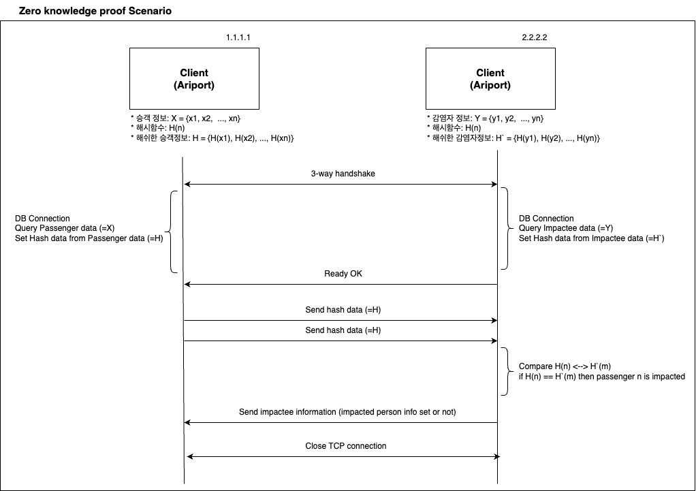
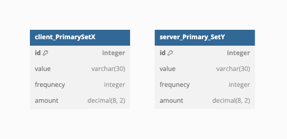
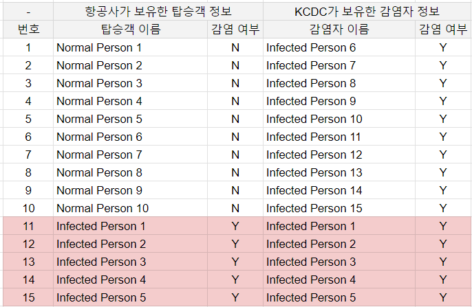
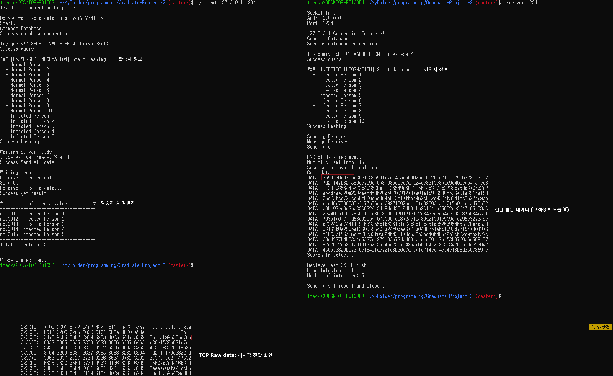

# Zero-knowledge Proof

## 개요
* Tech Stack
  * Popular language (C lang)
  * RDB
  * Socket Client/Server
  * openSSL(Hash function)
* Hash 함수를 이용한 영지식 증명
* 2020년 수원대학교 다른 지도교수님의 졸업 과제입니다.
* 재미있는 프로젝트로 생각되어 구현해보았습니다.

### 영지식 증명 (Zero knowledge Proof)
자신이 알고 있는 지식이나 정보등을 상대방에게 공개하지 않고도 자신이 그 내용을 알고 있음을 증명하는 방법

### Scenario

* Client: 항공사
* Server: KCDC (질병관리본부)
* 시나리오
    1. 항공사는 자신의 승객들 X = {x1,x2,...,xn}  중 코로나 감염자를 색출하기 위해 KCDC에게 검토 요청 
    2. KCDC는 항공사로부터 전달 받은 데이터를 토대로 자신이 가지고 있던 코로나 확진자 정보Y = {y1,y2,...,ym}와 비교
    3. 코로나 확진자가 존재하는 경우 항공사에게 해당 고객 정보 전달
* Goal
    * 항공사는 고객의 신상정보를 제공하지 않고, 양성 확진자 확인
    
## Contents
### Zero-knownledge proof architecture

### DB Scheme

## 테스트

#### 테스트 데이터셋

#### 테스트 결과

* 항공사는 고객 정보를 노출하지 않고 KCDC에게 감염자 확인 요청
* KCDC는 항공사의 고객 정보를 모른 상태로 감염자 확인
* 항공사는 감염자를 정상적으로 확인 (Infected Person 1 ~ 5)